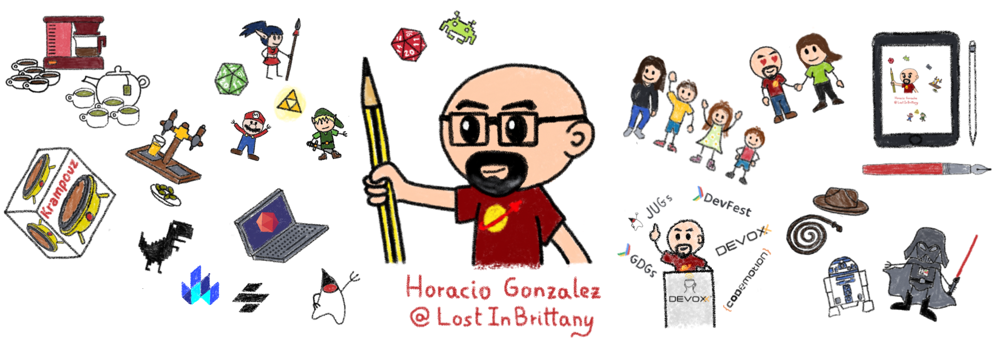

### Hello World 👋

I'm Horacio, a Spaniard lost in Brittany (France).

For the last 6 years, I worked as Director of DevRel at [OVHcloud](https://twitter.com/OVHcloud). Now I am taking some weeks off before starting a new role.

I am also the co-founder and leader of the [FinistDevs](https://finistdevs.org/) and [@RdvSpeakers](https://twitter.com/RdvSpeakers) communities.

I love web development, and everything around Web Components and standards web in particular. I also love to discuss Kubernetes, AI and cloud in general.

I am a frequent speaker at conferences and meetups, you can find my [speaker profile on Notist](https://noti.st/lostinbrittany).

<!--
**LostInBrittany/LostInBrittany** is a ✨ _special_ ✨ repository because its `README.md` (this file) appears on your GitHub profile.

Here are some ideas to get you started:

- 🔭 I’m currently working on ...
- 🌱 I’m currently learning ...
- 👯 I’m looking to collaborate on ...
- 🤔 I’m looking for help with ...
- 💬 Ask me about ...
- 📫 How to reach me: ...
- 😄 Pronouns: ...
- ⚡ Fun fact: ...
-->
